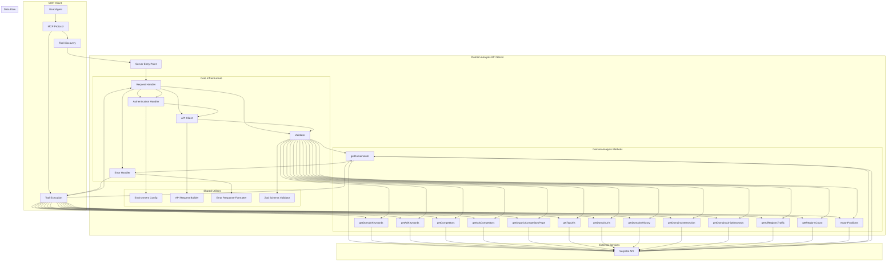
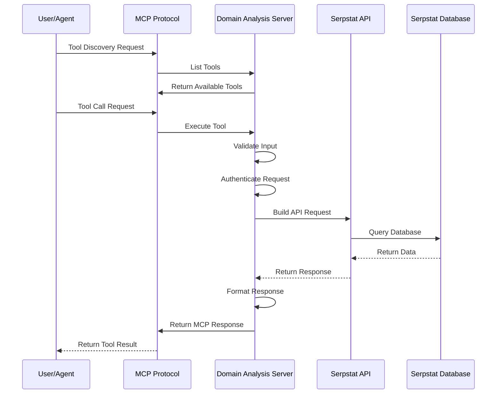
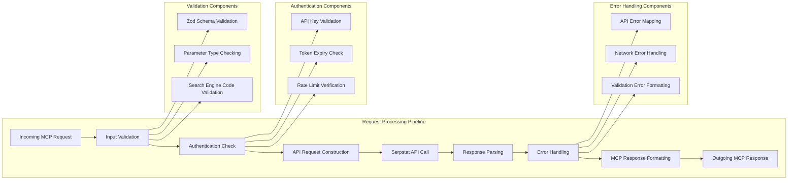
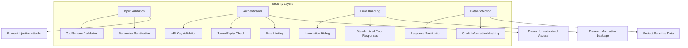

# Domain Analysis API MCP Server Architecture

## System Architecture Overview

## Data Flow Architecture

## Method Categories and Relationships

```mermaid
graph TD
    subgraph "Domain Analysis Methods"
        subgraph "Core Domain Analysis"
            A[getDomainsInfo]
            B[getDomainKeywords]
            C[getDomainUrls]
        end
        
        subgraph "Competitor Analysis"
            D[getCompetitors]
            E[getAdsCompetitors]
            F[getOrganicCompetitorsPage]
        end
        
        subgraph "Traffic & Performance"
            G[getAllRegionsTraffic]
            H[getRegionsCount]
            I[getDomainsHistory]
        end
        
        subgraph "Multi-Domain Analysis"
            J[getDomainsIntersection]
            K[getDomainsUniqKeywords]
        end
        
        subgraph "URL & Content Analysis"
            L[getTopUrls]
            M[exportPositions]
        end
        
        subgraph "Advertising Analysis"
            N[getAdKeywords]
        end
    end
    
    A --> O[Common Domain Parameter]
    B --> O
    C --> O
    D --> O
    E --> O
    F --> O
    G --> O
    H --> O
    I --> O
    J --> O
    K --> O
    L --> O
    M --> O
    N --> O
    
    O --> P[se: Search Engine]
    O --> Q[domain: Domain Name]
    
    B --> R[Advanced Filtering]
    N --> R
    J --> R
    K --> R
    
    M --> S[CSV Export]
    I --> T[Historical Data]
    
    classDef core fill:#e1f5fe,stroke:#01579b,stroke-width:2px
    classDef competitor fill:#f3e5f5,stroke:#4a148c,stroke-width:2px
    classDef traffic fill:#e8f5e8,stroke:#1b5e20,stroke-width:2px
    classDef multi fill:#fff3e0,stroke:#e65100,stroke-width:2px
    classDef url fill:#fce4ec,stroke:#880e4f,stroke-width:2px
    classDef advertising fill:#f1f8e9,stroke:#33691e,stroke-width:2px
    
    class A,B,C core
    class D,E,F competitor
    class G,H,I traffic
    class J,K multi
    class L,M url
    class N advertising
```

## Request Processing Pipeline

## Key Components

### 1. MCP Server Infrastructure
- **Entry Point**: Main server initialization with MCP SDK
- **Request Handler**: Processes incoming MCP requests
- **Tool Registry**: Manages available tools and their schemas

### 2. Shared Utilities
- **API Client**: Handles HTTP communication with Serpstat API
- **Authentication**: Manages API key validation and authentication
- **Validator**: Input validation using Zod schemas
- **Error Handler**: Standardized error response formatting

### 3. Method-Specific Handlers
Each of the 15 domain analysis methods has:
- **Input Schema**: Zod validation for parameters
- **Request Builder**: Constructs API request payload
- **Response Parser**: Processes Serpstat API response
- **Output Formatter**: Converts to MCP response format

### 4. External Dependencies
- **Serpstat API**: Primary data source for all domain analysis
- **Environment Variables**: Configuration for API keys and settings
- **TypeScript**: Type safety and development experience

## Security Considerations

This architecture provides a solid foundation for building a robust, secure, and maintainable Domain Analysis API MCP server with comprehensive error handling, validation, and standardized responses.