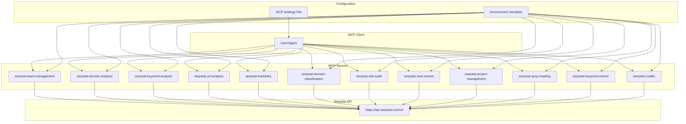

# Serpstat MCP Servers Implementation Plan

## Overview

This plan outlines the implementation of MCP (Model Context Protocol) servers for the Serpstat API, starting with the Team Management API and expanding to cover all 12 functional areas of the Serpstat platform.

## Architecture Approach

Based on expert recommendations, we will implement **multiple smaller MCP servers** rather than one large server. This approach provides:

- **Better Security**: Limits blast radius if one component is compromised
- **Easier Maintenance**: Smaller, focused codebases are easier to test and debug
- **Flexible Scaling**: Each server can be scaled independently based on demand
- **Fine-grained Permissions**: Each server gets only the secrets and permissions it needs

## MCP Server Structure

### Phase 1: Team Management API (Starting Point)

**Server Name**: `serpstat-team-management`
**Base URL**: `https://api.serpstat.com/v4`
**Authentication**: API token via environment variable
**Protocol**: JSON-RPC 2.0

**Tools to Implement**:
1. `add_user` - Invite new users to the team
2. `get_list` - Get list of team members with pagination
3. `activate_user` - Activate inactive users
4. `deactivate_user` - Deactivate active users
5. `remove_user` - Remove users from the team

### Phase 2: Additional API Modules

Following the Team Management API, we'll implement servers for:

1. **Domain Analysis API** - Domain SEO statistics
2. **Keyword Analysis API** - Keyword selection and suggestions
3. **URL Analysis API** - SEO stats for specific URLs
4. **Backlinks API** - Backlinks and referring domains
5. **Domain Classification API** - Domain categorization
6. **Site Audit API** - SEO error scanning
7. **Rank Tracker API** - Keyword rank tracking
8. **Project Management API** - Project management
9. **SERP Crawling API** - SERP crawling with AI
10. **Keyword Volume Checker API** - Keyword volume scanning
11. **Credits API** - API credit usage statistics

## Technical Implementation

### Project Structure

```
/Users/ben/Documents/Cline/MCP/
├── serpstat-team-management/
│   ├── package.json
│   ├── tsconfig.json
│   ├── src/
│   │   ├── index.ts
│   │   ├── types.ts
│   │   ├── client.ts
│   │   └── utils.ts
│   ├── build/
│   └── README.md
├── serpstat-domain-analysis/
└── [additional servers...]
```

### Dependencies

Each server will require:
- `@modelcontextprotocol/sdk` - MCP SDK
- `axios` - HTTP client for API requests
- `zod` - Schema validation
- `typescript` - Type safety

### Authentication

All servers will use environment variable configuration:
```json
{
  "env": {
    "SERPSTAT_API_TOKEN": "user-provided-api-token"
  }
}
```

### Error Handling

Each tool will implement:
- Request validation using Zod schemas
- Proper error responses with detailed messages
- HTTP status code handling
- API-specific error codes mapping

## Implementation Steps

### Step 1: Team Management API Server
1. Set up TypeScript project structure
2. Create base HTTP client for Serpstat API
3. Implement each tool with proper validation
4. Add comprehensive error handling
5. Build and configure the server

### Step 2: Testing and Validation
1. Unit tests for each tool
2. Integration tests with actual API calls
3. Error scenario testing
4. Performance testing

### Step 3: Documentation
1. Tool usage examples
2. Authentication setup guide
3. Error handling documentation
4. Best practices guide

### Step 4: Additional Servers
1. Repeat implementation process for each API module
2. Ensure consistent patterns across servers
3. Add module-specific features as needed

## Configuration

### MCP Settings File

Each server will be configured in the MCP settings file:

```json
{
  "mcpServers": {
    "serpstat-team-management": {
      "command": "node",
      "args": ["/path/to/serpstat-team-management/build/index.js"],
      "env": {
        "SERPSTAT_API_TOKEN": "user-provided-token"
      }
    }
  }
}
```

## Security Considerations

- API tokens stored securely via environment variables
- Each server has minimal required permissions
- Input validation for all parameters
- Rate limiting awareness (1-10 requests per second)
- Proper error message sanitization

## Performance Optimization

- Connection pooling for HTTP requests
- Caching where appropriate (user lists, etc.)
- Pagination support for large datasets
- Efficient data transformation

## Future Considerations

- Version compatibility with future API changes
- Monitoring and logging capabilities
- Graceful degradation for API outages
- Configuration management for multiple environments

## Success Criteria

1. All MCP servers successfully connect and authenticate
2. Each tool functions as documented in Serpstat API
3. Proper error handling for all scenarios
4. Comprehensive test coverage
5. Clear documentation and examples
6. Consistent user experience across all servers

## Timeline

- **Week 1**: Team Management API server
- **Week 2**: Testing and documentation
- **Week 3-4**: Additional API servers (2-3 per week)
- **Week 5**: Final testing and deployment documentation

This plan provides a structured approach to implementing a comprehensive set of MCP servers for the Serpstat API, ensuring quality, maintainability, and scalability.

## Architecture Diagram


